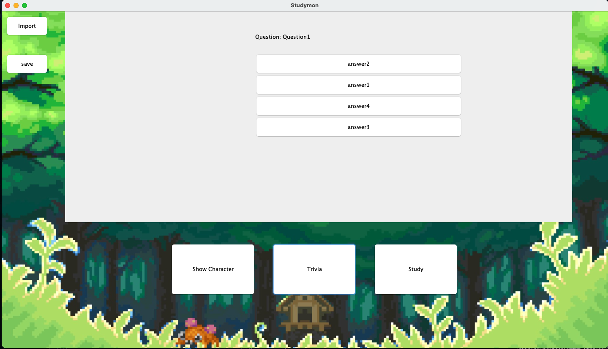

## Studymon (last updated December, 2021)
A simple program to help study using flashcards.

## Features

1. Study mode -
  *Flash card mode to help the user study. Flash card needs to be imported first using the import button.*
2. Trvia Mode -
  *Classic quiz style game to help the user check if they mastered the flash card contents. Flash cards are required to be imported first.*
3. Personal Pokemons -
  *At the beginning of the game, the users are required to select their partner, who they will be taking care of by aceing their study contents*
  
## Program Showcase

